modelviz 
Quantitative model diagrams (QMD) for NONMEM.
----

[](https://travis-ci.org/guiastrennec/modelviz)

[](https://codecov.io/gh/guiastrennec/modelviz)

----

## Rationale
To facilitate model communication and evaluation through intuitive visual representation of their structure, parameter estimates, uncertainty and variability.

## Standard model diagrams
Models are commonly represented by their structural properties but lack any information on parameter and must therefore be used along with a parameter table. You can create SMD in the [modelviz app](https://guiastrennec.shinyapps.io/modelviz_app/).
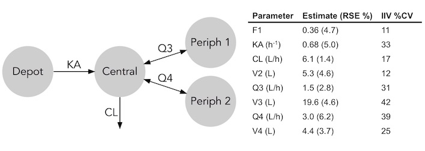

## Quantitative model diagrams
Quantitative model diagrams intuitively displays structural model properties as well as parameter properties. You can create QMD in the [modelviz app](https://guiastrennec.shinyapps.io/modelviz_app/).


## Dynamic QMD
Dynamic QMD (dQMD) visually represent the dynamic processes proper to pharmacometric models. It allows to intuitively conceptualize complex processes such as feedback, non-linearity over time. Examples of dQMD are available on the [modelviz app](https://guiastrennec.shinyapps.io/modelviz_app/). dQMDs are currently just a concept and not a built in feature of modelviz but will be coming in future updates.


## Modelviz installation
```r
# Install modelviz package (first time only)
devtools::install_github("guiastrennec/modelviz")

# Load the modelviz package
library(modelviz)
```

## Workflow
```r
# Import dataset from a NONMEM run
qmd_info <- import_qmd_info(dir = '/nonmem/runs', runno = '101')

# Generate QMD
qmd(qmd_info)
```

## The qmd_info object
### Structure
The **qmd_info** objects are lists of 7 levels:
- **descr** : model description *[character string, optional]*
- **theta** : theta typical values and RSE (%) *[data.frame, optional]*
- **omega** : typical values (%) and RSE (%) *[data.frame, optional]*
- **data** : individual parameter values *[data.frame, optional]*
- **advan** : NONMEM ADVAN subroutine *[integer, required]*
- **parsed_comp** : parsed compartment information *[data.frame, required]*
- **parsed_arrow** : parsed arrow information *[data.frame, required]*

**qmd_info** for ```examples$onecomp```
``` r
$descr
[1] "Example 1-comp: Nevirapine in HIV- and TB-infected south african (day values w/o rifampicin)"

$theta
         KA   CL     V
tvprm  3.57 2.76 137.0
rse   61.00 5.70   7.2

$omega
           KA       CL
tvprm 84.2615 55.40758
rse    0.8500  0.27000

$data
NULL

$advan
[1] 2

$parsed_comp
    label  prm output
1   Depot <NA>  FALSE
2 Central    V   TRUE

$parsed_arrow
  from   to prm     dir
1   A1   A2  KA forward
2   A2 <NA>  CL forward
```

### Creation of qmd_info
You can automatically create **qmd_info** via the function ```import_qmd_info()``` or manually
with the help of the function ```skeleton_qmd_info()```.

The function ```import_qmd_info()``` read NONMEM model files (.mod or .lst type) and extract their key information:
- $PROBLEM and file name will be stored in the **descr**
- $SUBROUTINE will be stored in **advan**
- The levels **theta** and **omega** are generated by associating parameter labels (read in the comments of $THETA and $OMEGA) to the final parameter values and RSE (read from the .ext file).
- When available a patab table will be stored in **data**
- If ADVAN refers to a predefined NONMEM library (ADVAN 1-4, 11-12) pre-built **parsed_comp** and **parsed_arrow** will be added to the **qmd_info**. If ADVAN refers to a differential equation system (ADVAN 6,8,13), the $MODEL and $DES block will be parsed to generate **parsed_comp** and **parsed_arrow**.

### Differential equation parsing
Modelviz differential equation parser works with most general ODE. The parser can handle terms in the form ```±K*A(1), ±(CL/V)*A(1)```. In the first case ```K``` will be used to scale the arrow between ```A(1)``` and another compartment, in the second case ```CL``` will be used to scale the arrow between ```A(1)``` and ```V``` to scale the compartment ```A(1)```.

Differential equations should be written in their developed form. For example do not use ```-((CL+Q)/VC)*A(x)``` but rather ```-(CL/V)*A(x) -(Q/V)*A(x)```.

Other "unknown" form of equation starting by ± and containing a compartment amount e.g ```+(EMAX*A(1))/(EC50 + A(1))``` will be properly parsed (arrows and compartment will be created) but no parameter will be used for scaling.

## Examples
The Modelviz package contains 6 built-in examples intended to demonstrate the utility of QMD in various case scenario and to familiarize users with the package.

### One-compartment model
The example dataset ```onecomp``` contains typical pharmacokinetic parameters values and uncertainty for nevirapine. _(Elsherbiny et al. 2009)_

Unscaled                   |  Scaled
:-------------------------:|:-------------------------:
``` qmd(examples$onecomp, scaling = FALSE)``` | ```qmd(examples$onecomp)```
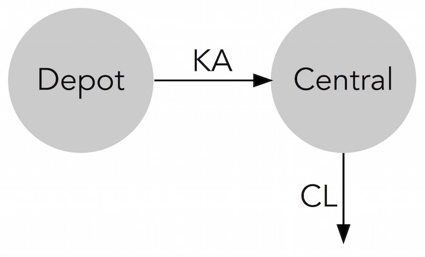 | 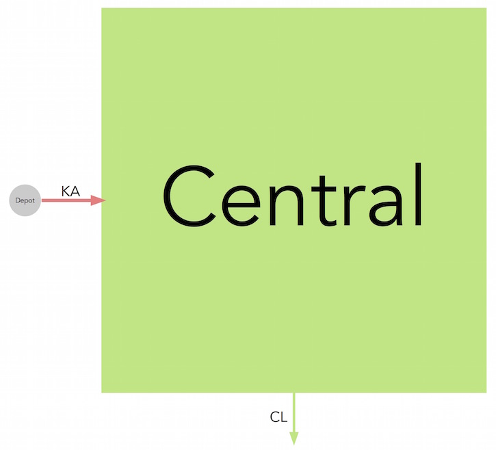


### Two-compartment model
The example dataset ```twocomp``` contains typical pharmacokinetic parameters values and uncertainty for miltefosine. _(Dorlo et al. 2008)_

Unscaled                   |  Scaled
:-------------------------:|:-------------------------:
```qmd(examples$twocomp, scaling = FALSE)``` | ```qmd(examples$twocomp)```
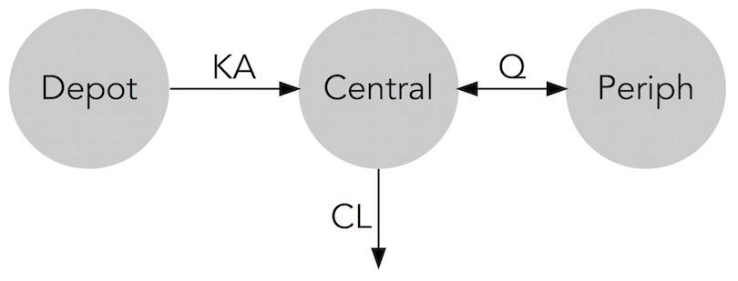 | 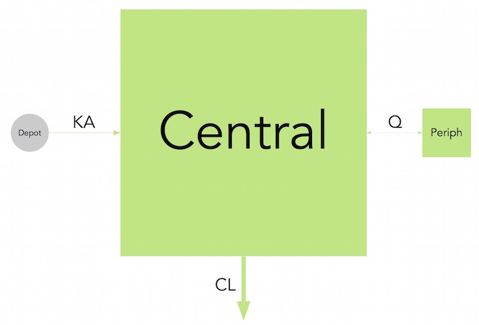


### Three-compartment model
The example dataset ```threecomp``` contains typical pharmacokinetic parameters values and uncertainty for ciclosporin in paediatric renal transplant candidates. _(Fanta et al. 2007)_

Unscaled                   |  Scaled
:-------------------------:|:-------------------------:
```qmd(examples$threecomp, scaling = FALSE)``` | ```qmd(examples$threecomp)```
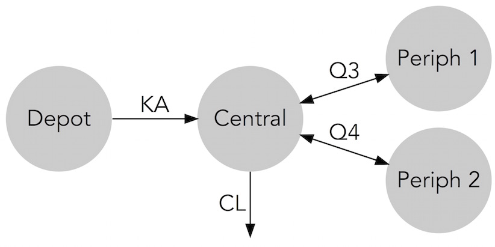 | 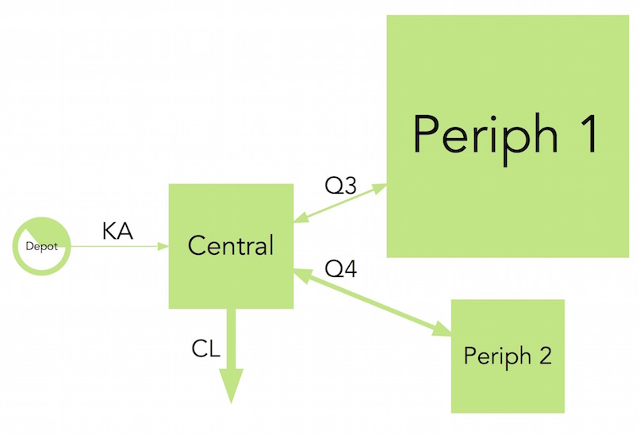


### Gastro-Intestinal Tansit Time (GITT) model
The example dataset ```gitt``` contains typical pharmacokinetic parameters values and uncertainty for felodipine gastro-intestinal transit time. _(Hénin et al. 2012)_

Note : In this case IIV color code has been applied

Unscaled                   |  Scaled
:-------------------------:|:-------------------------:
```qmd(examples$gitt, scaling = FALSE, rank = c(1,2,2,2,2,2,3,4,5,5,3))``` | ```qmd(examples$gitt, rank = c(1,2,2,2,2,2,3,4,5,5,3)), arrow_scale_fun = function(x){sqrt(x)}, color_scaling = 'IIV')```
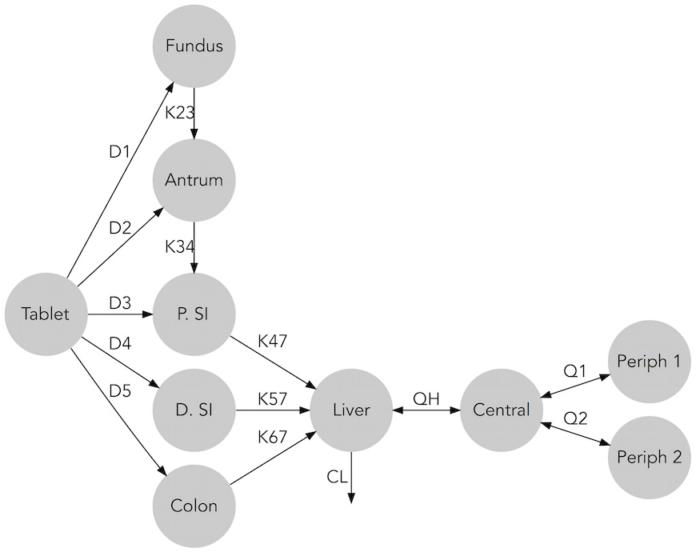 | 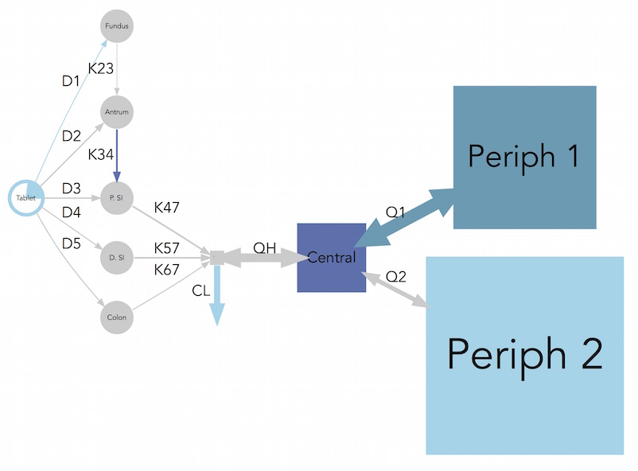


### Bedaquiline metabolites model
The example dataset ```metabolite``` contains typical pharmacokinetic parameters values and uncertainty for bedaquiline and two of its metabolites. _(Svensson et al. 2013)_

Note : In this case manual color scheme has been applied

Unscaled                   |  Scaled
:-------------------------:|:-------------------------:
 ```qmd(examples$metabolite, scaling = FALSE, rank = c(1,2,3,4,5,6,7,7,6,7,6,7,6))``` | ```qmd(examples$metabolite, rank = c(1,2,3,4,5,6,7,7,6,7,6,7,6), comp_scale_fun = function(x){sqrt(x/50)}, arrow_scale_fun = function(x){sqrt(x)})```
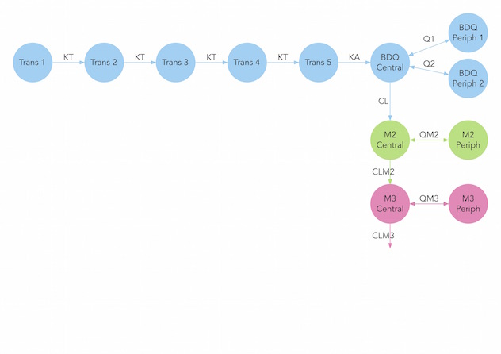 | 


### PBPK model
The example dataset ```pbpk``` contains typical pharmacokinetic parameters values for theophylline in adult male. _(Björkman et al. 2004)_

Note : In this case the PBPK layout has been applied.

Unscaled                   |  Scaled
:-------------------------:|:-------------------------:
```qmd(examples$pbpk, pbpk_layout = TRUE, scaling = FALSE)``` | ```qmd(examples$pbpk, pbpk_layout = TRUE, arrow_scale_fun = function(x) { 1.5*x + 1 })```
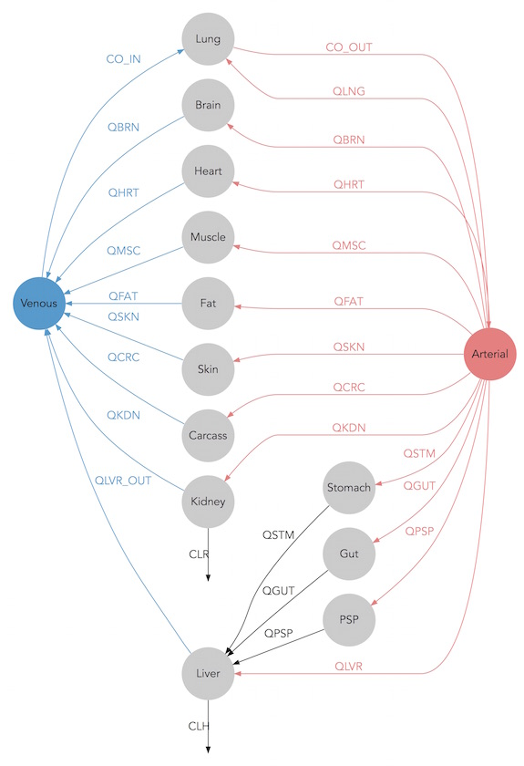 | 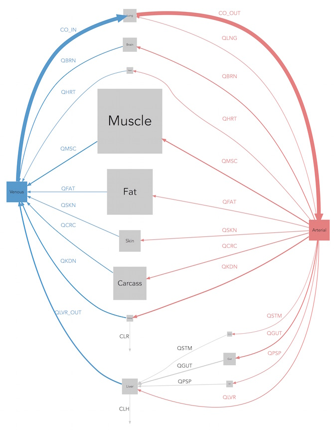

## Advanced options
### Scaling options
Model parameter can have extreme values and use different units (e.g volumes in mL or L), therefore the choice of the scaling function applied to compartment and arrows is open to the user. By default the compartment surface area is scaled proportionally to the volumes (```comp_scale_fun = function(x) { sqrt(x) }```) and arrows are scaled linearly to their rate or clearance (```arrow_scale_fun = function(x) { x }```). By customizing the ```comp_scale_fun``` and ```arrow_scale_fun``` the uses can use an infinite number of function that can be constant (eg. ```3```), linear (eg. ```2*x + 1```), non-linear (eg. ```sqrt(x)```), or complex (eg. logit transform).

### Manual layout
Modelviz automatically creates a layout by minimizing the size of the graph and the arrows length. If as specific layout is desired the options ```rank``` can be used to pair compartments together. The ```rank``` option can be used along with ```flipped```. By default ranks are attributed from left to right, if flipped = TRUE ranks will be attributed from top to bottom.

### Color scale  
In Modelviz the color scale can be used to represent either IIV or RSE, the choice of either of the two is made with the option ```color_scaling = "RSE"```. A three level color code will be defined, by default cutoff values are set at 25 % and 50 % but can be changed with the ```color_cutoff = c(25, 50)``` argument.

If no color scheme should be applied ```color_scaling``` can be set to NONE and the default grey color can be changed via ```unscaled_color```.

To define a specific color scheme, the argument ```arrow_color_manual``` and ```comp_color_manual``` can be used to define a color for each arrow or each compartment. Note the order of the arrows and compartment is the one defined in the levels ```parsed_comp``` or ```parsed_arrow``` in the ```qmd_info``` object.

### Visual aspect settings
Many other visual aspects of the diagrams can be changed such as the labels font (```font = "Arial"```) or labels size (```comp_fontsize = 1.5, arrow_fontsize = 1```), arrow labels can be turned off (```labels = FALSE```). The compartment filling can be disabled (```filled = FALSE```) nodes will then be represented by their edges, the shape can also be changed for either scaled (```scaled_shape = "square"```) or (```unscaled_shape = "circle"```) compartments, and finally color transparency can be applied (```alpha = 1```).

### PBPK options
With PBPK models the option ```pbpk_layout = TRUE``` must be used to obtain the classical layout with arteries on one side and veins on the other. In order for Modelviz to recognize the vein and arterial compartments you must define their label when they do not match the defaults (```vein_comp_label = "venous", artery_comp_label = "arterial"```).

### Output options
Modelviz can be used in shiny apps in such cases the argument ```shiny = TRUE``` should be defined. More outputs can be defined via ```output = "graph"``` (output can take the values, DOT, SVG, graph, vivagraph and visNetwork).

### Graphviz options
Many more options can be used to change the aspect of the diagram via the argument ```gv_options = NULL```. Most common options are:
- ```"splines = ortho"``` for square angled arrows, ```"splines = true"``` being the default
- ```"rankdir = 1"``` will increase the space between compartments of same rank
- ```"nodesep = 1"``` will increase the space between compartments of different rank

More options can be found [here](http://www.graphviz.org/doc/info/attrs.html)
