# modelviz 

[](https://travis-ci.org/guiastrennec/modelviz)

[](https://codecov.io/gh/guiastrennec/modelviz)

```{r, include = FALSE}
library(modelviz)
```

## Overview
Automated generation of quantitative model diagrams for NONMEM.

## Rationale
To facilitate model communication and evaluation through intuitive visual representation of their structure, parameter estimates, uncertainty (RSE) and variability (IIV).

## Standard model diagrams
Models are commonly represented as standard model diagrams (SMD) showing their structural properties but lacking any information on parameter and must therefore be used along with a parameter table.

```{r smd example, eval = TRUE, echo = FALSE}
qmd(examples$threecomp, scaling = FALSE, 
    save_qmd = TRUE, format = 'png', width = 400,
    file_name = 'inst/img/smd_example.png')
```


Examples of SMD can be viewed on the [modelviz app](https://guiastrennec.shinyapps.io/modelviz_app/).


## Quantitative model diagrams
Quantitative model diagrams (QMD) are used to intuitively displays the structural model along with the parameter values and their uncertainty or variability.

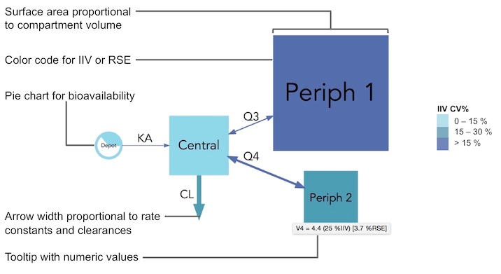

Examples of QMD can be viewed on the [modelviz app](https://guiastrennec.shinyapps.io/modelviz_app/).


## Dynamic QMD
Dynamic QMD (dQMD) visually represent the dynamic processes proper to pharmacometric models. It allows to intuitively conceptualize complex processes such as feedback, non-linearity over time. Examples of dQMD are available on the [modelviz app](https://guiastrennec.shinyapps.io/modelviz_app/). dQMDs are currently only a concept and not a built-in feature of modelviz but will hopefully be coming in future updates.


## `modelviz` installation
```r
# Install modelviz package (first time only)
devtools::install_github("guiastrennec/modelviz")

# Load the modelviz package
library(modelviz)
```


## Workflow
Import dataset from a NONMEM run
```r
qmd_info <- import_qmd_info(dir = '/nonmem/runs', runno = '101')
```

Generate QMD graph
```r
qmd(qmd_info)
```


## The `qmd_info` object
### Structure
The `qmd_info` objects are lists of 8 levels:

- `descr` : model description *[character string, optional]*
- `theta` : theta typical values and RSE (%) *[data.frame, optional]*
- `omega` : typical values (%) and RSE (%) *[data.frame, optional]*
- `data` : individual parameter values *[data.frame, optional]*
- `advan` : NONMEM ADVAN subroutine *[integer, required]*
- `des` : NONMEM $DES subroutine *[character strings, optional]*
- `parsed_comp` : parsed compartment information *[data.frame, required]*
- `parsed_arrow` : parsed arrow information *[data.frame, required]*

Example of `qmd_info` for `examples$onecomp`
```{r, eval = TRUE, echo = FALSE, comment = ''}
examples$onecomp
```


### Creation of the `qmd_info` object
You can automatically create `qmd_info` via the function `import_qmd_info()` or manually
with the help of the function `skeleton_qmd_info()`.

The function `import_qmd_info()` read NONMEM model files (`.mod` or `.lst` type) and extract their key information:

- `$PROBLEM` and file name will be stored in the `descr`
- `$SUBROUTINE` will be stored in `advan`
- The levels `theta` and `omega` are generated by associating parameter labels (read in the comments of `$THETA` and `$OMEGA`) to the final parameter values and RSE (read from the `.ext` file).
- When available a parameter table (`patab`) will be stored in `data` [currently not used]
- If `ADVAN` refers to a predefined NONMEM library (`ADVAN 1-4`,` 11-12`) `parsed_comp` and `parsed_arrow` levels will be added to the `qmd_info`. If `ADVAN` refers to a differential equation system (`ADVAN 6`,`8`,`13`), the `$MODEL` and `$DES` block will be parsed to generate `parsed_comp` and `parsed_arrow`.

### Differential equations parsing
The differential equation parser in `modelviz` works with most general ODE. The parser can handle terms in the form `±K*A(1), ±(CL/V)*A(1)`. In the first case `K` will be used to scale the arrow between `A(1)` and another compartment, in the second case `CL` will be used to scale the arrow between `A(1)` and `V` to scale the compartment `A(1)`.

Differential equations should be written in their developed form. For example do not use `-((CL+Q)/VC)*A(x)` but rather `-(CL/V)*A(x) -(Q/V)*A(x)`.

Other forms of equation starting by ± and containing a compartment amount e.g `+(EMAX*A(1))/(EC50 + A(1))` will be properly parsed (arrows and compartment will be created) but no parameter will be used for scaling.


## Advanced options
### Scaling options
Model parameter can have extreme values and use different units (e.g volumes in mL or L), therefore the choice of the scaling function applied to compartment and arrows is open to the user. By default the compartment surface area is scaled proportionally to the volumes (`comp_scale_fun = function(x) { sqrt(x) }`) and arrows are scaled linearly to their rate or clearance (`arrow_scale_fun = function(x) { x }`). By customizing the `comp_scale_fun` and `arrow_scale_fun` constant (eg. `3`), linear (eg. `2*x + 1`), non-linear (eg. `sqrt(x)`), or complex (eg. logit transform) scaling functions can be applied.

### Manual layout
Layout are automatically created by `modelviz` by minimizing the size of the graph and the arrows length. If as specific layout is desired the options `rank` can be used to order the compartments. The `rank` option can be used along with `flipped`. By default ranks are attributed from left to right, if `flipped = TRUE` ranks will be attributed from top to bottom.

### Color scale  
Color scales can be used to represent either IIV or RSE, which can be selected with the argument `color_scaling = "RSE"`. A three-level color code will be defined, by default cutoff values are set at 25 % and 50 % but can be changed with the `color_cutoff = c(25, 50)` argument.

If no color scheme should be applied `color_scaling` can be set to `NONE`. The unscaled default grey color can be changed via `unscaled_color`.

To manually assign colors, the arguments `arrow_color_manual` and `comp_color_manual` can be used to define a color for each arrow and each compartment. Note the order of the arrows and compartment is following their order in the `parsed_comp` and `parsed_arrow` levels of the `qmd_info` object.

### Visual aspect settings
Many other visual aspects of the diagrams can be changed such as the labels font (`font = "Arial"`), labels size (`comp_fontsize = 1.5, arrow_fontsize = 1`), disabling (`labels = FALSE`) or parsing (`parse_labels = TRUE`) arrow labels. The compartment filling can be disabled (`filled = FALSE`) nodes will then be represented by their edges only, the shape can also be changed for either scaled (`scaled_shape = "square"`) or (`unscaled_shape = "circle"`) compartments, and finally color transparency can be applied (`alpha = 0.5`).

### PBPK options
With PBPK models the options `pbpk_layout = TRUE` and `color_scaling = "PBPK"` must be used to obtain the classical layout with blue veins on one side and red arteries on the other. In order for `modelviz` to recognize the venous and arterial compartments, their exact label must be defined their label when they do not match the defaults (`vein_comp_label = "venous", artery_comp_label = "arterial"`).

### Additional options
Many more options can be used to change the aspect of the diagram via the `graph_attrs` argument. The `graph_attrs` argument must be provided as a `data.frame` and contain the `attr`,
`value` and `type` columns e.g. `data.frame(attr = "layout", value = "dot", type = "graph")`.

A few useful options are
- `splines` [attr], `ortho` [value], `graph` [type] for square angled arrows, `true` [value] being the default value
- `rankdir` [attr], `1` [value], `graph` [type] changes the space between compartments of a same rank
- `nodesep` [attr], `1` [value], `graph` [type] changes the space between compartments of different rank

More options can be found [here](http://www.graphviz.org/doc/info/attrs.html)


## Examples
The `modelviz` package contains 6 built-in examples intended to demonstrate the utility of QMD in various case scenarios and to familiarize users with the package.

### One-compartment model
The example dataset `onecomp` contains typical pharmacokinetic parameters values and uncertainty for nevirapine. _(Elsherbiny et al. 2009)_

#### SMD
```{r onecomp_unscaled file, eval = TRUE, echo = FALSE}
qmd(examples$onecomp, scaling = FALSE, 
    save_qmd = TRUE, format = 'png', width = 400,
    file_name = 'inst/img/1_comp_unscaled.png')
```

```{r onecomp_unscaled, eval = FALSE}
qmd(examples$onecomp, scaling = FALSE)
```

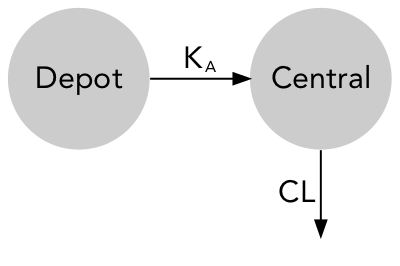

#### QMD
```{r onecomp file, eval = TRUE, echo = FALSE}
qmd(examples$onecomp, scaling = TRUE, 
    color_scaling = 'RSE', save_qmd = TRUE, 
    format = 'png', width = 400,
    file_name = 'inst/img/1_comp.png')
```

```{r onecomp, eval = FALSE}
qmd(examples$onecomp, color_scaling = 'RSE')
```

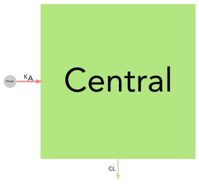


### Two-compartment model
The example dataset `twocomp` contains typical pharmacokinetic parameters values and uncertainty for miltefosine. _(Dorlo et al. 2008)_

#### SMD
```{r twocomp_unscaled file, eval = TRUE, echo = FALSE}
qmd(examples$twocomp, scaling = FALSE, 
    save_qmd = TRUE, format = 'png', width = 400,
    file_name = 'inst/img/2_comp_unscaled.png')
```

```{r twocomp_unscaled, eval = FALSE}
qmd(examples$twocomp, scaling = FALSE)
```

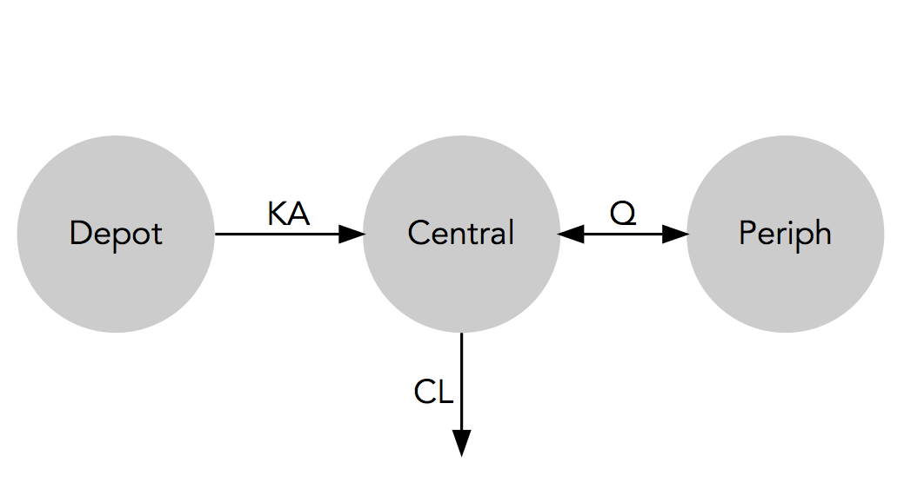

#### QMD
```{r twocomp file, eval = TRUE, echo = FALSE}
qmd(examples$twocomp, scaling = TRUE, 
    color_scaling = 'RSE', save_qmd = TRUE, 
    format = 'png', width = 400,
    file_name = 'inst/img/2_comp.png')
```

```{r twocomp, eval = FALSE}
qmd(examples$twocomp, color_scaling = 'RSE')
```

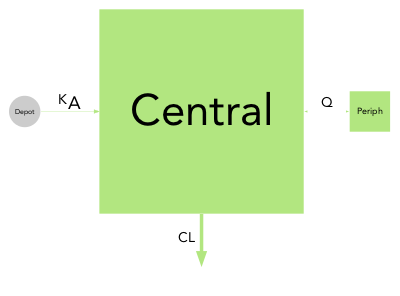


### Three-compartment model
The example dataset `threecomp` contains typical pharmacokinetic parameters values and uncertainty for ciclosporin in paediatric renal transplant candidates. _(Fanta et al. 2007)_

#### SMD
```{r threecomp_unscaled file, eval = TRUE, echo = FALSE}
qmd(examples$threecomp, scaling = FALSE, 
    save_qmd = TRUE, format = 'png', width = 400,
    file_name = 'inst/img/3_comp_unscaled.png')
```

```{r threecomp_unscaled, eval = FALSE}
qmd(examples$threecomp, scaling = FALSE)
```

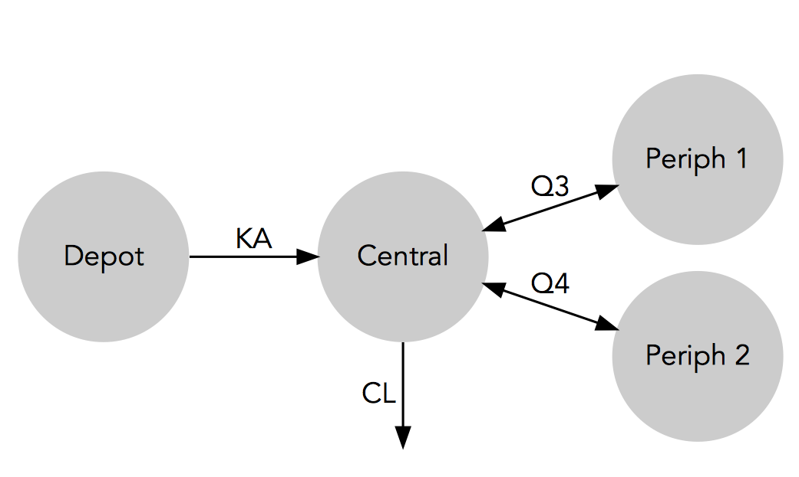

#### QMD
```{r threecomp file, eval = TRUE, echo = FALSE}
qmd(examples$threecomp, scaling = TRUE, 
    color_scaling = 'IIV', save_qmd = TRUE, 
    format = 'png', width = 400,
    file_name = 'inst/img/3_comp.png')
```

```{r threecomp, eval = FALSE}
qmd(examples$threecomp, color_scaling = 'IIV')
```

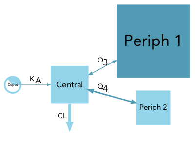


### Gastro-Intestinal Tansit Time (GITT) model
The example dataset `gitt` contains typical pharmacokinetic parameters values and uncertainty for felodipine gastro-intestinal transit time. _(Hénin et al. 2012)_

#### SMD
```{r git_unscaled file, eval = TRUE, echo = FALSE}
qmd(examples$gitt, scaling = FALSE, 
    rank = c(1, 2, 2, 2, 2, 2, 3, 4, 5, 5),
    save_qmd = TRUE, format = 'png', width = 400,
    file_name = 'inst/img/gitt_unscaled.png')
```

```{r gitt_unscaled, eval = FALSE}
qmd(examples$gitt, scaling = FALSE,
    rank = c(1, 2, 2, 2, 2, 2, 3, 4, 5, 5))
```

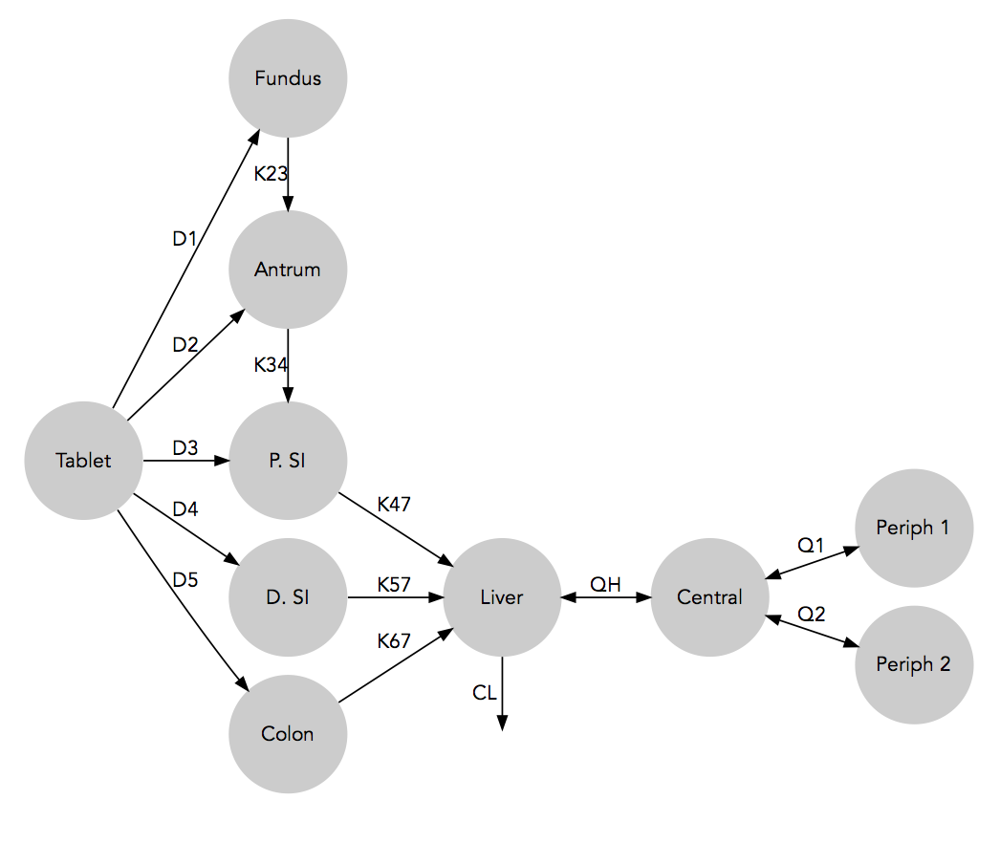

#### QMD
```{r gitt file, eval = TRUE, echo = FALSE}
qmd(examples$gitt, scaling = TRUE, 
    rank = c(1, 2, 2, 2, 2, 2, 3, 4, 5, 5),
    arrow_scale_fun = function(x){sqrt(x)},
    color_scaling = 'IIV', save_qmd = TRUE, 
    format = 'png', width = 400,
    file_name = 'inst/img/gitt.png')
```

```{r gitt, eval = FALSE}
qmd(examples$gitt, color_scaling = 'IIV',
    rank = c(1, 2, 2, 2, 2, 2, 3, 4, 5, 5),
    arrow_scale_fun = function(x){sqrt(x)})
```

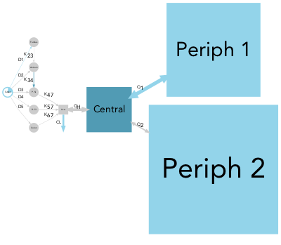


### Bedaquiline metabolites model
The example dataset `metabolite` contains typical pharmacokinetic parameters values and uncertainty for bedaquiline and two of its metabolites. _(Svensson et al. 2013)_

#### SMD
```{r metabolite_unscaled file, eval = TRUE, echo = FALSE}
qmd(examples$metabolite, scaling = FALSE, 
    rank = c(1, 2, 3, 4, 5, 6, 7, 7, 6, 7, 6, 7),
    save_qmd = TRUE, format = 'png', width = 400,
    file_name = 'inst/img/metabolite_unscaled.png')
```

```{r metabolite_unscaled, eval = FALSE}
qmd(examples$metabolite, scaling = FALSE,
    rank = c(1, 2, 3, 4, 5, 6, 7, 7, 6, 7, 6, 7))
```

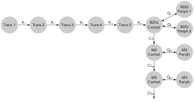

#### QMD
```{r metabolite file, eval = TRUE, echo = FALSE}
qmd(examples$metabolite, scaling = TRUE, 
    rank = c(1, 2, 3, 4, 5, 6, 7, 7, 6, 7, 6, 7),
    arrow_scale_fun = function(x){sqrt(x)},
    comp_scale_fun = function(x){sqrt(x/50)},
    alpha = 0.6,
    comp_color_manual = c(rep('dodgerblue', 8), 
                          rep('seagreen', 2), 
                          rep('coral', 2)),
    arrow_color_manual = c(rep('dodgerblue', 8), 
                           rep('seagreen', 2), 
                           rep('coral', 2)),
    color_scaling = 'IIV', save_qmd = TRUE,
    format = 'png', width = 400,
    file_name = 'inst/img/metabolite.png')
```

```{r metabolite, eval = FALSE}
qmd(examples$metabolite, color_scaling = 'IIV',
    rank = c(1, 2, 3, 4, 5, 6, 7, 7, 6, 7, 6, 7),
    comp_scale_fun = function(x){sqrt(x/50)},
    arrow_scale_fun = function(x){sqrt(x)},
    alpha = 0.6,
    comp_color_manual = c(rep('dodgerblue', 8), 
                          rep('seagreen', 2), 
                          rep('coral', 2)),
    arrow_color_manual = c(rep('dodgerblue', 8), 
                           rep('seagreen', 2), 
                           rep('coral', 2)))
```

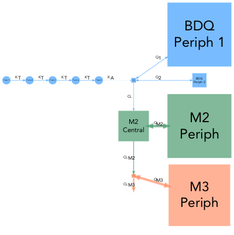

Note: In this case manual color scheme has been applied


### PBPK model
The example dataset `pbpk` contains typical pharmacokinetic parameters values for theophylline in adult male. _(Björkman et al. 2004)_

#### SMD
```{r pbpk_unscaled file, eval = TRUE, echo = FALSE}
qmd(examples$pbpk, scaling = FALSE, pbpk_layout = TRUE,
    color_scaling = 'PBPK', save_qmd = TRUE, 
    format = 'png', width = 400,
    file_name = 'inst/img/pbpk_unscaled.png')
```

```{r pbpk_unscaled, eval = FALSE}
qmd(examples$pbpk, scaling = FALSE, 
    pbpk_layout = TRUE, color_scaling = 'PBPK')
```

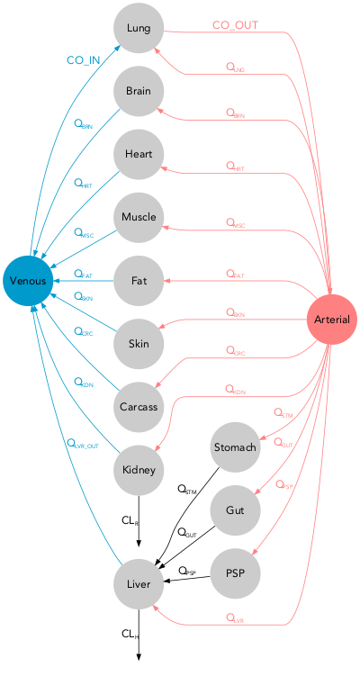

#### QMD
```{r pbpk file, eval = TRUE, echo = FALSE}
qmd(examples$pbpk, scaling = TRUE, 
    flipped = TRUE,
    arrow_scale_fun = function(x){sqrt(1.5*x + 1)},
    pbpk_layout = TRUE, color_scaling = 'PBPK',
    save_qmd = TRUE,
    format = 'png', width = 600,
    file_name = 'inst/img/pbpk.png')
```

```{r pbpk, eval = FALSE}
qmd(examples$pbpk, flipped = TRUE
    pbpk_layout = TRUE, color_scaling = 'PBPK',
    arrow_scale_fun = function(x){sqrt(2*x + 1)})
```

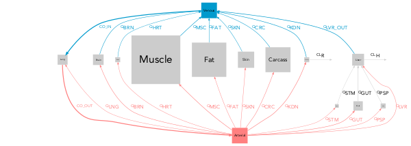

Note: In this case `pbpk_layout` and `color_scaling = 'PBPK'` have been used.
