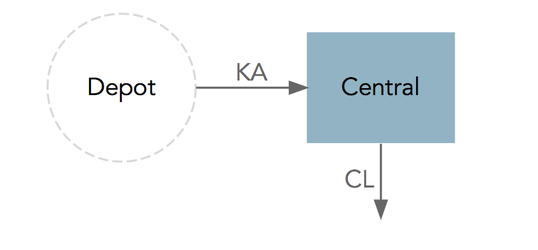
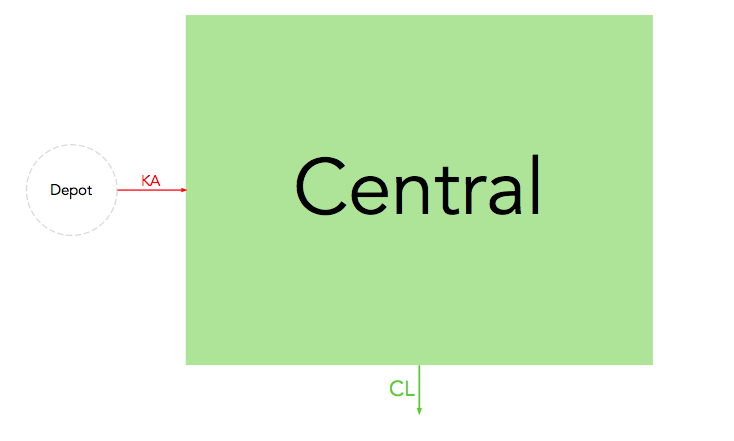
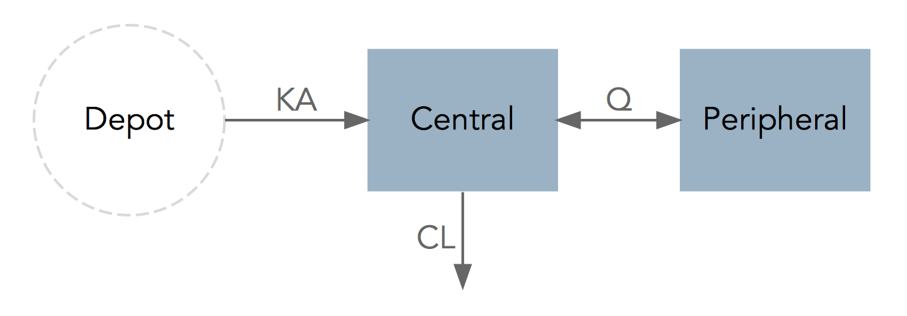
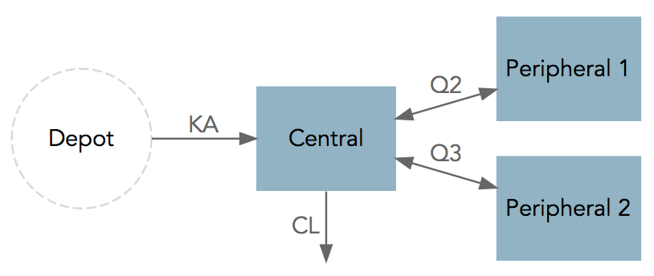
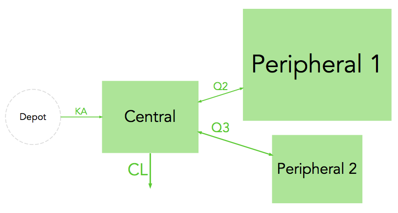

# modelviz
Quantitative model diagrams (QMD) for NONMEM

## Rationale
To facilitate model communication and evaluation through intuitive visual representation of their structure, parameter values and uncertainty.

## Installation
```r
# Install modelviz package (first time only)
devtools::install_github("guiastrennec/modelviz")

# Load modelviz package
library(modelviz)
```

## Examples
### One-compartment model

The example dataset ```onecomp``` contains typical pharmacokinetic parameters values and uncertainty for nevirapine _(Elsherbiny et al. 2009)_

#### Without scaling
```r
modelviz(onecomp, scaling=FALSE)
```



#### With scaling
```r
modelviz(onecomp, scaling=TRUE)
```


### Two-compartment model

The example dataset ```twocomp``` contains typical pharmacokinetic parameters values and uncertainty for miltefosine _(Dorlo et al. 2008)_

#### Without scaling
```r
modelviz(twocomp, scaling=FALSE)
```



#### With scaling
```r
modelviz(twocomp, scaling=TRUE)
```


### Three-compartment model

The example dataset ```threecomp``` contains typical pharmacokinetic parameters values and uncertainty for ciclosporin in paediatric renal transplant candidates _(Fanta et al. 2007)_

#### Without scaling
```r
modelviz(threecomp, scaling=FALSE)
```



#### With scaling
```r
modelviz(threecomp, scaling=TRUE)
```



## How to use
```r
# Import dataset from a NONMEM run
prm_list <- prm_import(dir='../models/pk/', runno='001')

# Generate QMD
modelviz(prm_list)
```

## In development
Modelviz automatically handles outputs from NONMEM ADVAN 1-4, 11-12. A differencial equation translator will be implemented to make modelviz compatible with any model.

