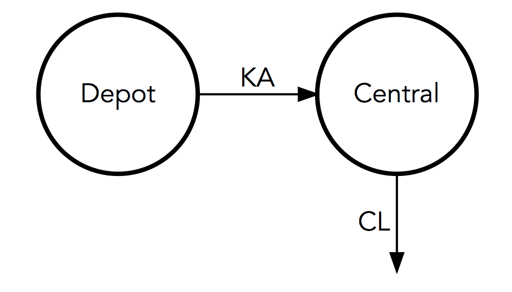
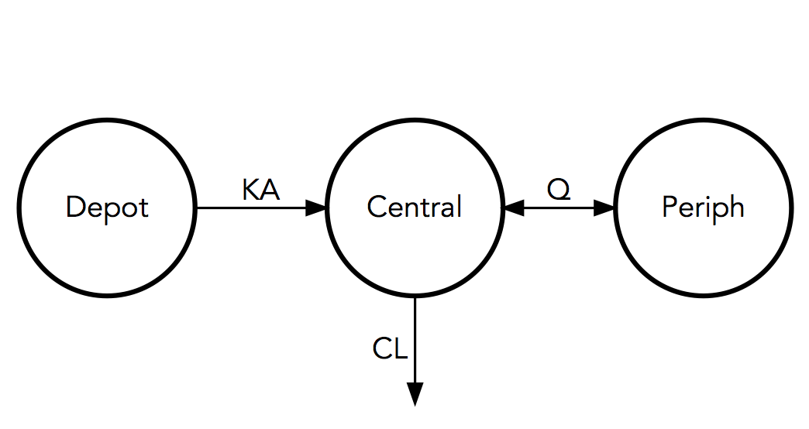
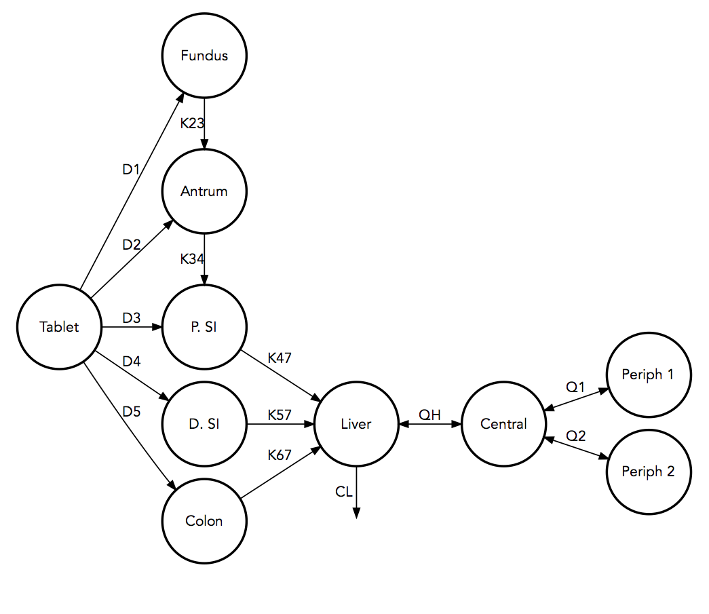
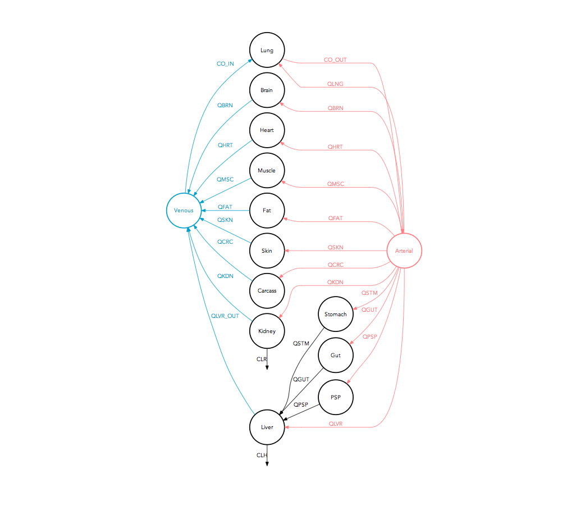

# modelviz
Quantitative model diagrams (QMD) for NONMEM

## Rationale
To facilitate model communication and evaluation through intuitive visual representation of their structure, parameter values and uncertainty.

## Installation
```r
# Install modelviz package (first time only)
devtools::install_github("guiastrennec/modelviz")

# Load modelviz package
library(modelviz)
```

## Examples
### One-compartment model

The example dataset ```onecomp``` contains typical pharmacokinetic parameters values and uncertainty for nevirapine _(Elsherbiny et al. 2009)_

#### Unscaled
```r
qmd(examples$onecomp, scaling = FALSE, filled = FALSE)
```


#### Scaled
```r
qmd(examples$onecomp, scaling = TRUE)
```


### Two-compartment model

The example dataset ```twocomp``` contains typical pharmacokinetic parameters values and uncertainty for miltefosine _(Dorlo et al. 2008)_

#### Unscaled
```r
qmd(examples$twocomp, scaling = FALSE)
```



#### Scaled
```r
qmd(examples$twocomp, scaling = TRUE)
```


### Three-compartment model

The example dataset ```threecomp``` contains typical pharmacokinetic parameters values and uncertainty for ciclosporin in paediatric renal transplant candidates _(Fanta et al. 2007)_

#### Unscaled
```r
qmd(examples$threecomp, scaling = FALSE)
```


#### Scaled
```r
qmd(examples$threecomp, scaling = TRUE)
```


### Gastro-Intestinal Tansit Time (GITT) model

The example dataset ```gitt``` contains typical pharmacokinetic parameters values and uncertainty for felodipine gastro-intestinal transit time _(Hénin et al. 2007)_

#### Unscaled
```r
qmd(examples$gitt, scaling = FALSE, rank = c(1,2,2,2,2,2,3,4,5,5,3))
```


*Note : a ranking is manually applied to obtained a specific layout. An automated mode will come shortly*

#### Scaled
```r
qmd(examples$gitt, scaling = TRUE, rank = c(1,2,2,2,2,2,3,4,5,5,3)), arrow_scale_fun = function(x){sqrt(x)})
```


*Note : the default scaling function is sqrt(x) for volumes which scale the compartment proportionally to their surface area. For arrows the default is x. In this examples Q1 = 174 L/h a non linear scaling function has then be applied to the arrows using arrow_scale_fun*


### PBPK model

The example dataset ```pbpk``` contains typical pharmacokinetic parameters values for theophylline in adult male. _(Fanta et al. 2007)_

#### Unscaled
```r
qmd(examples$pbpk, pbpk_layout = TRUE, scaling = FALSE, filled = FALSE, unscaled_color = 'black')
```



#### Scaled
```r
qmd(examples$pbpk, pbpk_layout = TRUE, scaling = TRUE, filled = FALSE, scaled_shape = 'circle', arrow_scale_fun = function(x) { 1.5*x + 1 }, unscaled_color = 'black')
```


## How to use
```r
# Import dataset from a NONMEM run
qmd_info <- import_qmd_info(dir = '/nonmem/runs', runno = '101')

# Generate QMD
qmd(qmd_info)
```

## In development
Modelviz automatically handles outputs from NONMEM ADVAN 1-4, 11-12. A differencial equation translator will be implemented to make modelviz compatible with any model.
