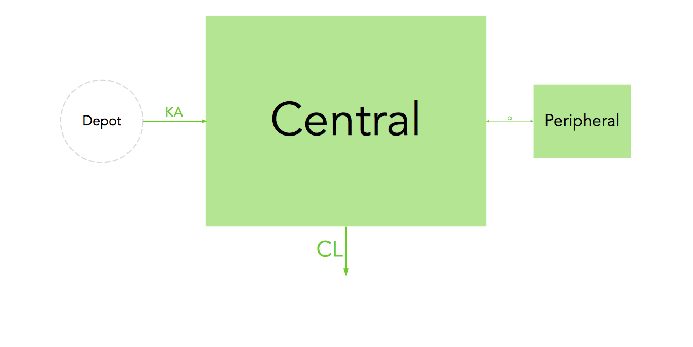

# modelviz
Quantitative model diagrams (QMD) for NONMEM

## Rationale
To facilitate model communication and evaluation through intuitive visual representation of their structure, parameter values and uncertainty.

## Installation

```{r, eval=FALSE}
# Install modelviz package (first time only)
devtools::install_github("guiastrennec/modelviz")

# Load modelviz package
library(modelviz)
```

## Example

### Without scaling
```r
modelviz(twocomp, scaling=FALSE)
```


### With scaling
```r
modelviz(twocomp, scaling=TRUE)
```


## How to use
```r
# Import dataset from a NONMEM run
prm_list <- prm_import(dir='../models/pk/', runno='001')

# Generate QMD
modelviz(prm_list)
```
